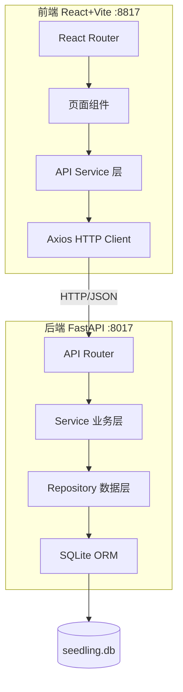
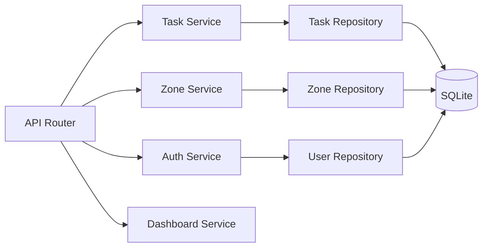
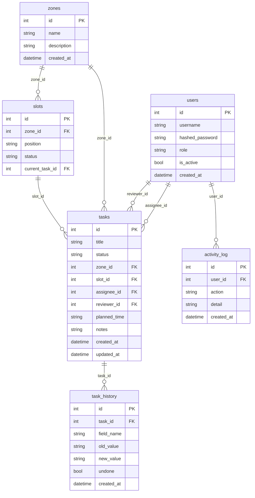

## 1. 架构设计



## 2. 技术说明

- 前端：React@18 + TypeScript + Vite + TailwindCSS@3 + ECharts
- 初始化工具：Vite (react-ts template)
- 后端：FastAPI + Uvicorn + SQLAlchemy + Alembic（可选）
- 数据库：SQLite（seedling.db）
- 认证：JWT (python-jose + passlib)
- 前后端通信：Axios，CORS 开放

## 3. 路由定义

| 路由 | 用途 |
|------|------|
| `/login` | 登录页 |
| `/` | 仪表盘首页 |
| `/zones` | 棚区管理页 |
| `/zones/:id` | 棚区详情（盘位网格） |
| `/tasks` | 任务管理页 |
| `/tasks/:id` | 任务详情（含撤销/重做） |
| `/users` | 用户管理页（管理员） |

## 4. API 定义

### 4.1 认证

```
POST /api/auth/login
  Request:  { username: string, password: string }
  Response: { access_token: string, token_type: "bearer", user: UserOut }

GET /api/auth/me
  Response: UserOut
```

### 4.2 用户管理

```
GET    /api/users          Response: UserOut[]
POST   /api/users          Request: UserCreate  Response: UserOut
PUT    /api/users/:id      Request: UserUpdate  Response: UserOut
DELETE /api/users/:id      Response: { ok: bool }
```

### 4.3 棚区管理

```
GET    /api/zones          Response: ZoneOut[]
POST   /api/zones          Request: ZoneCreate  Response: ZoneOut
PUT    /api/zones/:id      Request: ZoneUpdate  Response: ZoneOut
DELETE /api/zones/:id      Response: { ok: bool }

GET    /api/zones/:id/slots  Response: SlotOut[]
POST   /api/zones/:id/slots  Request: SlotCreate  Response: SlotOut
PUT    /api/slots/:id        Request: SlotUpdate  Response: SlotOut
```

### 4.4 任务管理

```
GET    /api/tasks              Response: TaskOut[]  (支持 ?status=&zone_id=&assignee_id= 筛选)
POST   /api/tasks              Request: TaskCreate  Response: TaskOut
GET    /api/tasks/:id          Response: TaskDetailOut
PUT    /api/tasks/:id          Request: TaskUpdate  Response: TaskOut
POST   /api/tasks/:id/transition  Request: { action: string }  Response: TaskOut
DELETE /api/tasks/:id          Response: { ok: bool }
```

### 4.5 撤销/重做

```
GET    /api/tasks/:id/history      Response: HistoryEntry[]
POST   /api/tasks/:id/undo         Response: TaskOut
POST   /api/tasks/:id/redo         Response: TaskOut
```

### 4.6 仪表盘统计

```
GET /api/dashboard/stats       Response: { by_status: {...}, total: int }
GET /api/dashboard/exceptions  Response: { by_type: {...} }
GET /api/dashboard/workload    Response: { by_user: {...} }
GET /api/dashboard/recent      Response: ActivityLog[]
```

### 4.7 TypeScript 类型定义

```typescript
interface UserOut {
  id: number;
  username: string;
  role: "admin" | "worker" | "reviewer";
  is_active: boolean;
  created_at: string;
}

interface ZoneOut {
  id: number;
  name: string;
  description: string;
  slot_count: number;
  utilization: number;
}

interface SlotOut {
  id: number;
  zone_id: number;
  position: string;
  status: "empty" | "in_use" | "abnormal";
  current_task_id: number | null;
}

type TaskStatus = "pending" | "in_progress" | "pending_review" | "completed" | "cancelled";

interface TaskOut {
  id: number;
  title: string;
  status: TaskStatus;
  zone_id: number;
  slot_id: number | null;
  assignee_id: number | null;
  reviewer_id: number | null;
  planned_time: string | null;
  notes: string;
  created_at: string;
  updated_at: string;
}

interface TaskDetailOut extends TaskOut {
  undo_count: number;
  redo_count: number;
  history: HistoryEntry[];
}

interface HistoryEntry {
  id: number;
  task_id: number;
  field_name: string;
  old_value: string;
  new_value: string;
  created_at: string;
  undone: boolean;
}
```

## 5. 服务端架构图



## 6. 数据模型

### 6.1 数据模型定义



### 6.2 数据定义语言

```sql
CREATE TABLE users (
    id INTEGER PRIMARY KEY AUTOINCREMENT,
    username TEXT NOT NULL UNIQUE,
    hashed_password TEXT NOT NULL,
    role TEXT NOT NULL CHECK(role IN ('admin', 'worker', 'reviewer')),
    is_active BOOLEAN NOT NULL DEFAULT 1,
    created_at DATETIME NOT NULL DEFAULT CURRENT_TIMESTAMP
);

CREATE TABLE zones (
    id INTEGER PRIMARY KEY AUTOINCREMENT,
    name TEXT NOT NULL,
    description TEXT DEFAULT '',
    created_at DATETIME NOT NULL DEFAULT CURRENT_TIMESTAMP
);

CREATE TABLE slots (
    id INTEGER PRIMARY KEY AUTOINCREMENT,
    zone_id INTEGER NOT NULL REFERENCES zones(id),
    position TEXT NOT NULL,
    status TEXT NOT NULL DEFAULT 'empty' CHECK(status IN ('empty', 'in_use', 'abnormal')),
    current_task_id INTEGER REFERENCES tasks(id),
    UNIQUE(zone_id, position)
);

CREATE TABLE tasks (
    id INTEGER PRIMARY KEY AUTOINCREMENT,
    title TEXT NOT NULL,
    status TEXT NOT NULL DEFAULT 'pending' CHECK(status IN ('pending', 'in_progress', 'pending_review', 'completed', 'cancelled')),
    zone_id INTEGER REFERENCES zones(id),
    slot_id INTEGER REFERENCES slots(id),
    assignee_id INTEGER REFERENCES users(id),
    reviewer_id INTEGER REFERENCES users(id),
    planned_time TEXT,
    notes TEXT DEFAULT '',
    created_at DATETIME NOT NULL DEFAULT CURRENT_TIMESTAMP,
    updated_at DATETIME NOT NULL DEFAULT CURRENT_TIMESTAMP
);

CREATE TABLE task_history (
    id INTEGER PRIMARY KEY AUTOINCREMENT,
    task_id INTEGER NOT NULL REFERENCES tasks(id),
    field_name TEXT NOT NULL,
    old_value TEXT NOT NULL DEFAULT '',
    new_value TEXT NOT NULL DEFAULT '',
    undone BOOLEAN NOT NULL DEFAULT 0,
    created_at DATETIME NOT NULL DEFAULT CURRENT_TIMESTAMP
);

CREATE TABLE activity_log (
    id INTEGER PRIMARY KEY AUTOINCREMENT,
    user_id INTEGER REFERENCES users(id),
    action TEXT NOT NULL,
    detail TEXT DEFAULT '',
    created_at DATETIME NOT NULL DEFAULT CURRENT_TIMESTAMP
);

-- 初始管理员账号
INSERT INTO users (username, hashed_password, role, is_active)
VALUES ('admin', '$2b$12$placeholder_hash', 'admin', 1);
```
